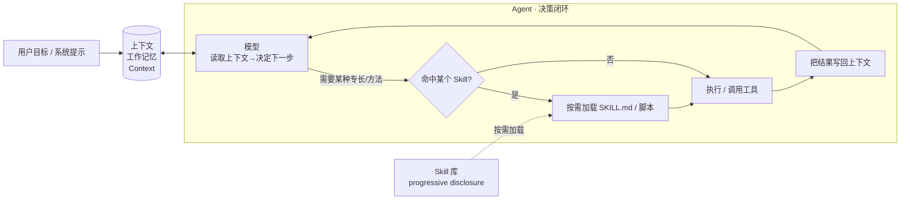

# 三个概念的关系说明：Agent · 上下文 · Skill

> 本文说明 **Agent**、**大模型的上下文（Context）**、**Skill** 三者如何咬合成一个可用的智能系统。
> 配套的三份单点资料见 `learning-materials/` 下的 `agent.html`、`llm-context.html`、`skill.html`。
> 生成日期：2026-09-09 · 领域：AI 工程

---

## 一句话总览

> **上下文**是 Agent 的"工作记忆"（燃料），**Skill** 是 Agent 的"方法弹药库"（能力），**Agent** 则是那个用上下文做决策、按需调用 Skill 去完成任务的主角。

可以把三者放进一条流水线里看：Agent 每走一步，都要**读上下文**判断"现在该干什么"，然后决定是否**加载某个 Skill** 来执行一段已沉淀好的方法，执行后再把结果**写回上下文**，进入下一步循环。

---

## 一、三个概念各是什么（快速回顾）

| 概念 | 本质 | 一句话 |
|------|------|--------|
| **Agent** | 以 LLM 为大脑、能调工具、自主多步决策的系统 | "代表用户把活干完的闭环" |
| **上下文 Context** | 模型一次推理能"看到"的输入 + 窗口容量上限 | "模型此刻的有限工作记忆" |
| **Skill** | 把某类任务的方法/知识打包成可复用文件（SKILL.md 等） | "可复用、按需加载的专长包" |

三者都不是同一层的东西：Agent 是**系统/编排层**，上下文是**运行时刻的状态/资源**，Skill 是**能力/知识资产**。

---

## 二、上下文如何影响 Agent 的工作（重点）

这是三者关系里最"运行时"的一条。Agent 再聪明，它每一步都只能基于**当前上下文窗口内还保留的内容**来做决定。因此：

1. **上下文 = Agent 的决策依据。** 用户目标、系统提示、历史对话、工具返回结果，都要先落进上下文，模型"看得到"才"想得到"。关键状态一旦被挤出窗口，Agent 就会"失忆"，做出前后矛盾的动作。
2. **窗口大小 = Agent 一次能摊开多少"工作台"。** 窗口越大，Agent 越能同时参考更多约束与历史；但如前所述，标称窗口 ≠ 有效利用，且大窗口带来更高算力成本。
3. **Agent 工程的核心之一是"上下文管理"。** 因为上下文有限，Agent 需要：
   - **摘要/压缩**：把长历史凝成系统摘要再写回上下文，保住关键事实；
   - **截断**：丢弃最早且不重要的轮次；
   - **检索注入（RAG）**：需要长文档时只把相关片段取进上下文；
   - **按需加载**：不把暂时用不上的大块内容占住窗口（这正是 Skill 的分层加载所解决的）。
4. **反馈闭环也要过上下文。** Agent 每次"观察"（工具/Skill 的结果）本质是把新文本写回上下文再交给模型，形成"想→做→看→再想"的循环。

> **一个反例强化理解：** 若不给 Agent 做任何上下文管理，让它连续处理很多任务，早期的关键约束（如"禁止外发、需审批"）会随窗口滚动被挤掉，Agent 就可能"违规"。所以**上下文管理直接决定 Agent 行为是否可靠、安全**。

---

## 三、Skill 如何沉淀可复用的任务知识（重点）

Skill 解决的是 Agent/个人"每次都要重新解释怎么做"的痛点，把**方法知识**固化下来：

1. **把"经验"变成"文件"。** 一次做得好的流程，整理成 `SKILL.md`（YAML 元数据 + 分步指引）+ 可选脚本/资料，放进 `<项目>/.workbuddy/skills/<skill>/` 这类目录。
2. **用元数据做"触发匹配"。** Skill 顶部的 `name`/`description` 常驻轻量上下文，Agent 判断当前请求与哪个 Skill 相关，命中才去读完整指令。
3. **渐进式披露省上下文。** 平时只占约 100 token 的元数据，触发后才读 SKILL.md、按需再读脚本/资源——这正好缓解上面"上下文有限"的瓶颈，是 Skill 与上下文协作的关键机制。
4. **跨会话复用 + 输出一致。** 写一次、处处用：品牌格式、分析方法、概念学习流程……都能稳定复现，不需要每次从零写提示。
5. **可组合、可维护。** 复杂任务可由多个 Skill 组合；方法变了只需改那个 Skill 文件，不用改所有调用处。

> **三者闭环：** Skill 让 Agent "更会干活"，上下文让 Agent "记得住要怎么干"。Skill 决定了 Agent 的**能力上限与一致性**，上下文决定了 Agent **当次能否正确、安全地使用这些能力**。

---

## 四、一个串联实例：我本次的作业

我创建了一个项目级 Skill **`concept-mastery`**（概念精讲），并调用它学习了 Agent、上下文、Skill 三个概念——整个过程正好体现了三者协作：

| 环节 | 用到的机制 |
|------|-----------|
| 我把"怎么学一个概念"的方法固化下来 | 沉淀为 Skill（可复用、可自检） |
| 我在 WorkBuddy 中提出"学习 Agent 这个概念" | 命中 `concept-mastery` 的 description → 按需加载其 SKILL.md |
| Skill 要求"先定目标、再列核心问题、给结构化解释、配来源、做自检" | 生成步骤逐步执行 |
| 我要求"来源必须可核查、解释不得照搬" | Skill 的资料来源与自检规则约束了 Agent 行为 |
| 学习多份资料而不互相干扰 | 每份资料独立成文件；关系说明单独一页，避免挤爆上下文 |

所以：**Agent（我这次调用中扮演执行者）依赖有限的上下文做每一步决策；而 `concept-mastery` 这个 Skill 把我个人的"概念学习法"沉淀成了可复用资产，让 Agent 每次产出都稳、准、可核查。**

---

## 五、一张对照小结

| 关注点 | Agent | 上下文 Context | Skill |
|--------|-------|---------------|-------|
| 所属层级 | 系统 / 编排 | 运行时状态 | 能力 / 知识资产 |
| 回答的核心问题 | 谁来干、怎么自主推进 | 此刻"记得"什么、能看多长 | 干这类活有什么既定好方法 |
| 失败风险 | 无护栏 → 越权/跑偏 | 窗口被挤满 → 失忆 | 来源不可信 → 被注入/越权 |
| 协作点 | 用上下文决策，调度 Skill | 被 Agent 读写，被 Skill 分层加载 | 给 Agent 注入专长，省上下文 |

---

## 相关链接

- 学习卡片：`learning-materials/agent.html`、`llm-context.html`、`skill.html`
- Skill 本体：`.workbuddy/skills/concept-mastery/SKILL.md`
